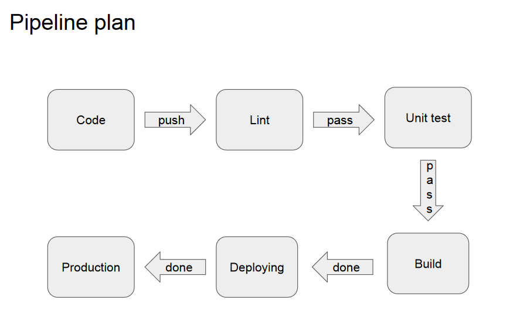

# CI/CD CON GITHUB ACTIONS

Proyecto final del curso del EATI2023 DEVOPS: TU PIPELINE DE CI/CD CON GITHUB ACTIONS.

## DevOps

**DevOps** es una metodología de desarrollo de software que combina el trabajo de los equipos de desarrollo y operaciones para mejorar la eficiencia y calidad del software. El objetivo principal de DevOps es automatizar el proceso de desarrollo, integración y entrega de software. Esto se logra mediante la implementación de herramientas y prácticas que permiten a los equipos de desarrollo y operaciones trabajar juntos de manera más efectiva.

## Continuous Integration/Continuous Delivery (CI/CD)

**Continuous Integration (CI)** es una práctica de DevOps que se utiliza para integrar el código de los desarrolladores en un repositorio compartido de forma regular. Esto significa que cada vez que se realiza un cambio en el código, se realizan test para asegurarse de que todo el código funcione correctamente, cuando los componentes actuan en conjunto.

**Continuous Delivery (CD)** es el siguiente paso después de la integración continua. Una vez que el código ha pasado las pruebas de integración, se automatiza su entrega al entorno de producción. Esto significa que cualquier cambio en el código se puede implementar de manera rápida y eficiente, lo que reduce el tiempo de espera entre la escritura del código y su entrega al usuario final.

## Sobre el proyecto

El proyecto cuenta con un archivo *main.py* cuya tarea consiste en crear un archivo, para poder pasar con exito los test implementados en *test.py*.
El archivo *pipeline.yml* ubicado en _eati2023-DevOps-Pipeline/.github/workflows/_ implementa un workflow de Github Actions **Pipeline Workflow** siguiendo el siguiente *Pipeline DevOps*:

